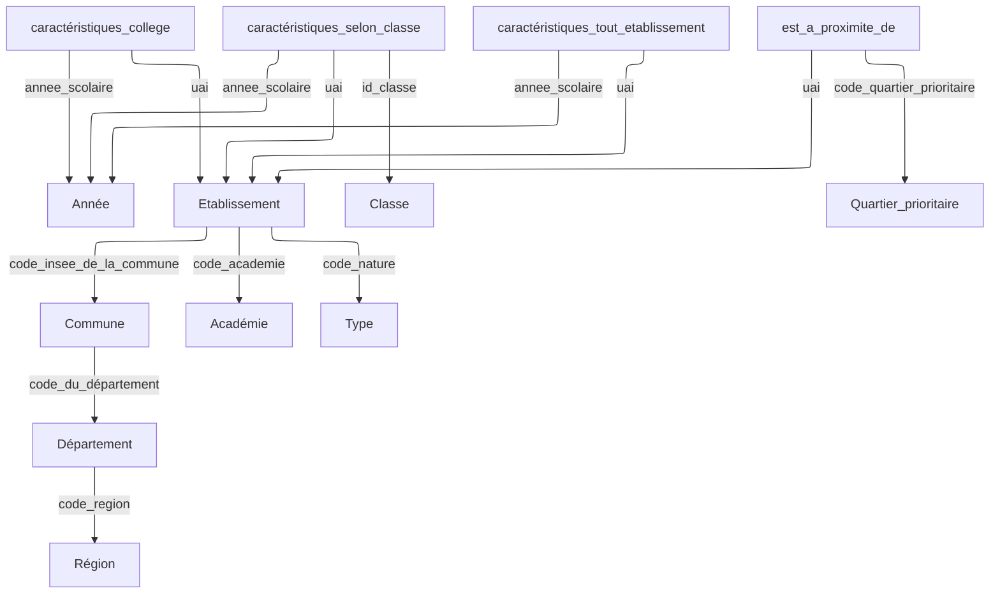

# S2.04

\+ Mattéo

Équipe C23

## Attributs calculables

table|nom|expression
-|-|-
cacarctéristiques_college|nbre_eleves_hors_segpa_hors_ulis|caractéristiques_tout_etablissement.effectifs - nbre_eleves_segpa  - nbre_eleves_ulis
cacarctéristiques_selon_classe|nbre_eleves_hors_segpa_hors_ulis_selon_niveau|effectif_filles + effectif_garçons - nbre_eleves_segpa_selon_niveau  - nbre_eleves_ulis_selon_niveau
caracteristiques_tout_etablissement|effectifs|$\sum\text{effectif\_filles} + \text{effectif\_garcons}$

## Types

### décimal précis -> `numeric`

> Valeurs discrètes avec un précision exacte (argent, coordonnées...). Prendre la plus grande précision et échelle dans le données fournies.

`numeric`, `decimal` : équivalents

**précision**: nombre total de chiffres
**échelle**: nombre de chiffres après la virgule

table|nom|précision|échelle
-|-|-|-
Etablissement|latitude|18|16
Etablissement|longitude|22|20
caractéristiques_tout_etablissement|ips|3|5

> Valeurs continues avec précision variable

### string -> `varchar(N)`

table|nom
-|-
caractéristiques_tout_etablissement|ecart_type_de_l_ips

> **N** : longueur maximum

nom|N|info
-|-|-
annee_scolaire|19|2 années consécutives + 1 tiret: attention au bug de l'an 10000 (année sur 4 chiffres): on considérera 9 (milliard), cars dans 5 milliards d'années la Terre deviendra inhabitable dans 5 milliards d'années, quand soleil deviendra une géante rouge.
code_du_departement|3||
code_insee_de_la_commune|5||
code_nature|3||
code_postal|5||
code_quartier_prioritaire|8||
code_region|2||
ep|7||
id_classe|9|École : ps, ms, gs, cp, ce1, ce2, cm1, cm2 Collège : 6eme, 5eme, 4eme, 3eme Lycée : seconde, premiere, terminale
lib_academie|16||
libelle_nature|7||
libelle_region|34||
nom_de_la_commune|45||
nom_departement|23||
nom_etablissement|108||
nom_quartier_prioritaire|85||
secteur|18|public, privé sous contrat...
uai|8|0941021Z

### entier -> `int`

> Entier standard.

## GCIR

## Questions

### Attribut "ep"

Quelles sont les valeurs possibles de l'attirubt *ep* (éducation prioritaire) ? Pourquoi ce n'est pas un booléen ?

Les valeurs possibles sont:

- REP
- REP+
- HORS EP

Il faudrait utiliser un [type énuméré](https://www.postgresql.org/docs/current/datatype-enum.html) au lieu d'une chaîne afin de garantir l'intégrité des données.

Ça dépend si on doit suivre strictement les types du DC.

## Liens

Transformer une association 1-1..* : <https://stph.scenari-community.org/bdd/0/co/rel4c22.html>
